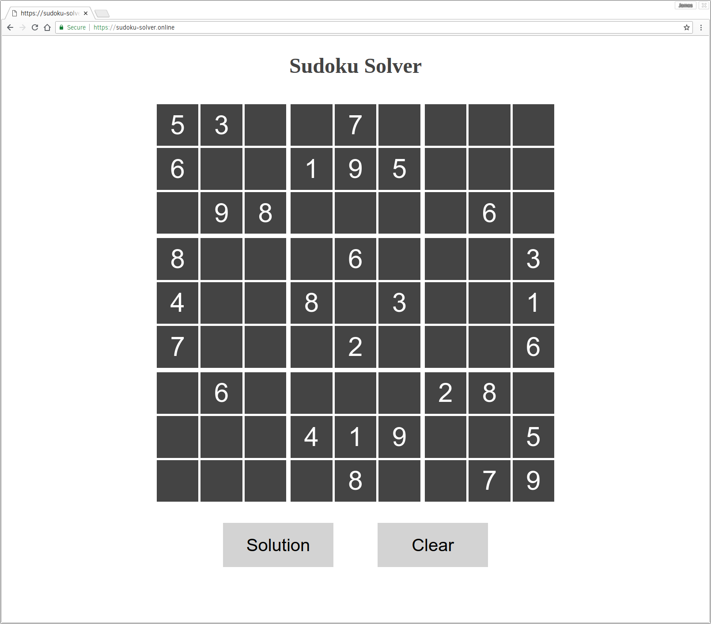
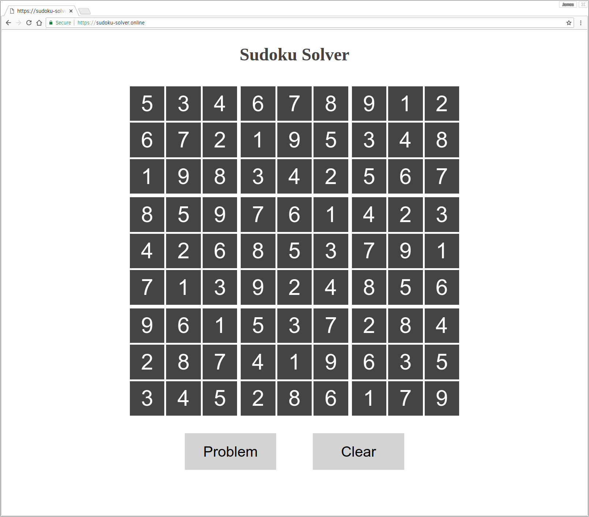

# Sudoku solver

The puzzle-solving logic is written in C and compiled to webassembly.

## 1. Enter a sudoku puzzle

## 2. Click the *solution* button to solve the puzzle

## 3. You can now toggle back and forth between the problem and the solution
